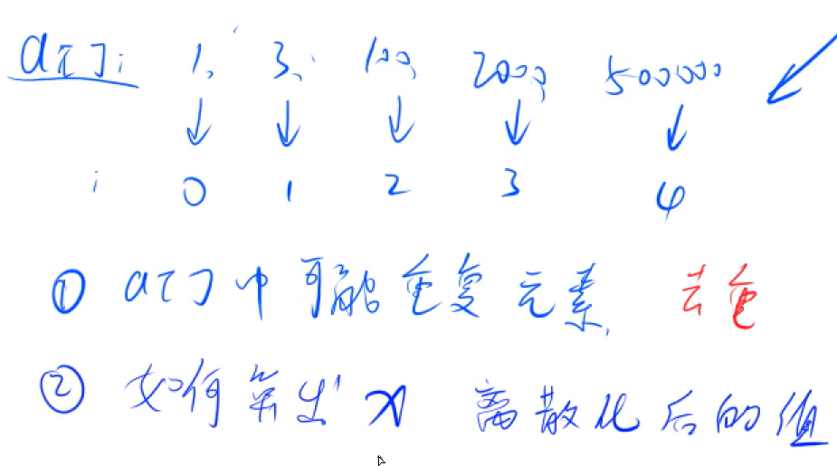

# 1 - 基础算法

## 1-N 离散化

  少数值域为$$0-10^9$$的大数被映射到自然数上的过程称为离散化



重点：如何算出大数被离散化后的值

用途：使用大 数作为下标

```java
大数数组a[]
	sort(a);
	a.erase(uique(a))
        
    int find(int x){
        int l = 0, r = a.size() - 1;
        
        while(l < r){
            int mid = l + r >> 2;
            if(a[mid] >= x) r = mid;
            else l = mid + 1;
        }
        
        // 将大数映射到1，2，3... 所以使用r+1
        return r + 1; 
    }
```

## 1-N 区间合并

​	给定N个区间，区间可能会有交集，将所有的区间合并起来。

步骤：

```java
// 1. 按区间左端点排序
// 2. 依次扫描各个区间： 包含、交集便合并区间；无交集则说明该区间是答案的一部分，继续扫描。

import java.util.ArrayList;
import java.util.Collections;
import java.util.Scanner;

public class AC803{
    public static void main(String[] args){
        Scanner scanner = new Scanner(System.in);

        int n = scanner.nextInt(), res = 0;
        ArrayList<Pair> segments = new ArrayList<Pair>();

        for(int i = 0; i < n; i++){
            int l = scanner.nextInt(), r = scanner.nextInt();

            segments.add(new Pair(l, r));
        }

        res = merge(segments);

        System.out.println(res);

        scanner.close();
    }

    public static int merge(ArrayList<Pair> segments){
        ArrayList<Pair> res = new ArrayList<Pair>();
        Collections.sort(segments);

        int st = (int)-2e-9, end = (int)-2e-9;

        for(int i = 0; i < segments.size(); i++){
            if(segments.get(i).first > end){
                if(st != (int)-2e-9)
                    res.add(new Pair(st, end));
                st = segments.get(i).first;
                end = segments.get(i).last;
            }
            else end = Math.max(end, segments.get(i).last);
        }

        if(st != (int)-2e-9 && end != (int)-2e-9)
            res.add(new Pair(st, end));

        return res.size();
    }
}

class Pair implements Comparable<Pair>{
    int first;
    int last;

    public Pair(int first, int last){
        this.first = first;
        this.last = last;
    }

    public int compareTo(Pair other){
        return Integer.compare(this.first, other.first);
    }
}
```